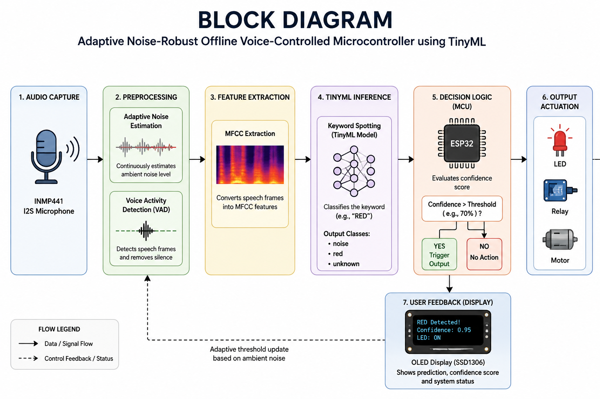
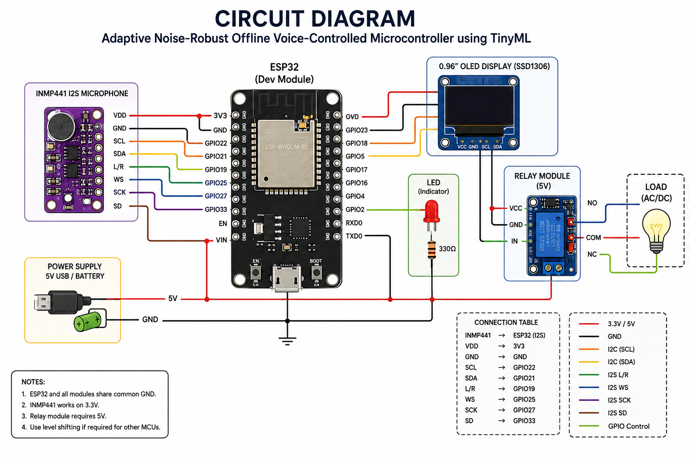
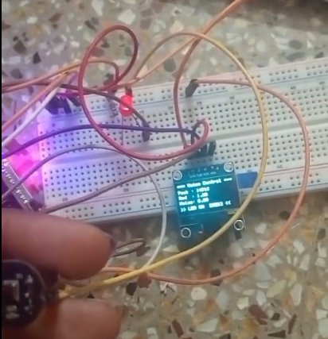
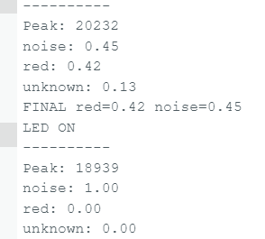

# Adaptive Noise-Robust Offline Voice-Controlled Microcontroller using TinyML

## Introduction

This project presents an adaptive noise-robust offline voice-controlled microcontroller system implemented using TinyML and ESP32. The system is capable of recognizing predefined voice commands locally on a microcontroller without relying on cloud computing or internet connectivity.

The project focuses on developing a low-power, privacy-preserving, and real-time voice interface suitable for embedded systems and IoT applications. Audio captured through the INMP441 I2S microphone is processed using adaptive noise filtering and Voice Activity Detection (VAD). Relevant speech features are extracted using MFCC (Mel-Frequency Cepstral Coefficients), and a TinyML model trained using Edge Impulse performs keyword spotting directly on the ESP32.

When the target keyword "RED" is detected with sufficient confidence, the ESP32 activates connected outputs such as LEDs or relays and displays inference information on an OLED display.

This project demonstrates how intelligent voice interfaces can be deployed efficiently on resource-constrained embedded hardware while maintaining low latency, privacy, and energy efficiency.

---

# Project Objectives

The primary objectives of this project are:

- To develop an offline voice recognition system using TinyML.
- To implement keyword spotting directly on ESP32 microcontroller hardware.
- To improve recognition reliability under noisy environmental conditions.
- To reduce dependence on cloud-based speech recognition systems.
- To provide a low-latency and privacy-preserving embedded AI solution.
- To demonstrate real-time embedded inference using Edge Impulse.
- To create a scalable framework for future multi-command voice control systems.

---

# System Overview

The system continuously listens for audio input through the INMP441 digital microphone. The incoming audio is processed in several stages:

1. Audio Capture
2. Noise Filtering
3. Voice Activity Detection
4. MFCC Feature Extraction
5. TinyML Inference
6. Decision Logic
7. Output Activation

The ESP32 performs all processing locally, eliminating the need for internet connectivity or external servers.

---

# System Workflow

```text
Microphone Input
       ↓
Adaptive Noise Filtering
       ↓
Voice Activity Detection (VAD)
       ↓
MFCC Feature Extraction
       ↓
TinyML Inference
       ↓
ESP32 Decision Logic
       ↓
LED / Relay Output
```

---

# Block Diagram

<p align="center">
  
</p>

## Description of Block Diagram

### Microphone Input

The INMP441 I2S microphone captures environmental audio signals and sends digital audio samples to the ESP32.

### Adaptive Noise Filtering

The system continuously estimates ambient noise levels and dynamically adjusts thresholds to improve recognition reliability under varying environmental conditions.

### Voice Activity Detection (VAD)

Voice Activity Detection identifies speech frames and eliminates silence or irrelevant noise, reducing unnecessary processing and power consumption.

### MFCC Feature Extraction

MFCC (Mel-Frequency Cepstral Coefficients) are extracted from the audio signal to represent speech characteristics in a compact and machine-learning-friendly form.

### TinyML Inference

The extracted MFCC features are passed to the TinyML keyword spotting model trained using Edge Impulse. The model classifies audio into predefined categories such as:
- noise
- red
- unknown

### ESP32 Decision Logic

The ESP32 evaluates prediction confidence scores. If the confidence for the target keyword exceeds a predefined threshold, the corresponding output is activated.

### Output Module

Outputs such as LEDs, relays, or motors are controlled based on the detected voice command and the result is displayed on the OLED display.

---

# Circuit Diagram

<p align="center">
  
</p>

## Circuit Description

The ESP32 acts as the central processing unit of the system.

### INMP441 Connections

The INMP441 microphone communicates with ESP32 through the I2S protocol:
- VDD → 3.3V
- GND → GND
- WS → GPIO25
- SCK → GPIO27
- SD → GPIO33

### OLED Display Connections

The SSD1306 OLED display communicates using I2C protocol:
- VCC → 3.3V / 5V
- GND → GND
- SCL → GPIO22
- SDA → GPIO21

### Output Device Connections

LEDs or relay modules are connected to ESP32 GPIO pins and are activated when the keyword is detected.

### Power Supply

The entire system is powered through a 5V USB supply or battery source.

---

# Hardware Prototype

<p align="center">
  
</p>

## Hardware Description

The prototype consists of:
- ESP32 Development Board
- INMP441 Digital Microphone
- OLED Display
- Relay Module / LED
- Breadboard
- Jumper Wires

The setup demonstrates real-time voice command recognition and output activation.

---

# Machine Learning Model

<p align="center">
  
</p>

## Model Description

The TinyML model was trained using Edge Impulse for keyword spotting applications. <br>

## Training <br>

We have trained the model by giving samples of our own voices which makes the model recognise the word "red". The user's voice can be recognised even if their voice was not a part of our training samples.
<br>

### Feature Extraction Technique

The model uses MFCC (Mel-Frequency Cepstral Coefficients) for speech feature extraction.

MFCC converts audio waveforms into compact numerical representations that preserve important speech characteristics while reducing data dimensionality.

### Classification Labels

The model classifies audio into:
- noise
- red
- unknown

### Deployment Platform

The trained model is deployed directly on ESP32 using Edge Impulse TinyML deployment libraries.

---

# Model Performance

| Metric | Value |
|---|---|
| Accuracy | 96.8% |
| Weighted Precision | 0.97 |
| Weighted Recall | 0.97 |
| Weighted F1 Score | 0.97 |
| ROC AUC | 0.98 |

## Performance Analysis

The model achieved high recognition accuracy under normal environmental conditions. Adaptive noise thresholding improved robustness in noisy surroundings.

The confusion matrix indicates reliable classification for:
- target keyword detection
- background noise rejection
- unknown speech handling

---

# Serial Monitor Output

<p align="center">
  
</p>

## Output Description

The serial monitor displays:
- audio peak levels
- confidence scores
- noise levels
- prediction results
- output activation status

### Sample Output

```text
Peak: 20232
noise: 0.45
red: 0.42
unknown: 0.13

FINAL red=0.42 noise=0.45
LED ON
```

The OLED display also provides real-time prediction feedback to the user.

---

# Software and Tools Used

| Software / Tool | Purpose |
|---|---|
| Arduino IDE | Firmware development |
| Edge Impulse | TinyML model training |
| TensorFlow Lite Micro | Embedded ML inference |
| ESP32 Board Package | ESP32 support |
| Adafruit SSD1306 Library | OLED display handling |
| I2S Driver Libraries | Audio communication |

---

# Repository Structure

```text
.
├── code/
│   ├── README.md
│   └── sketch_apr12b.ino
│
├── doc/
│   ├── README.md
│   ├── block.png
│   ├── voice_controller.pdf
│   └── voice_controller_report.pdf
│
├── hardware/
│   ├── README.md
│   ├── circuit_diagram.png
│   └── hardware.png
│
├── ml/
│   ├── README.md
│   ├── ml result.png
│   └── red_light_inferencing.zip
│
├── result/
│   ├── README.md
│   ├── demo.mp4
│   ├── ml result.png
│   └── output.png
│
├── LICENSE
└── README.md
```

---

# Applications

## Smart Home Automation

The system can control household appliances such as lights, fans, and switches using offline voice commands.

## Healthcare Assistive Systems

Voice-controlled assistive devices can help elderly and differently-abled individuals operate systems more easily.

## Industrial Automation

Hands-free machine operation improves worker safety and operational efficiency in industrial environments.

## Agricultural IoT

Voice commands can be used for irrigation control and monitoring systems in remote areas.

## Automotive Systems

Offline voice interfaces can be integrated into vehicles for controlling infotainment or auxiliary systems.

## Educational Embedded AI Kits

The project serves as an educational example of TinyML deployment on embedded hardware.

---

# Future Scope

Potential future improvements include:

- Multi-keyword recognition
- Multi-language support
- WiFi and MQTT integration
- Smart home ecosystem integration
- Ultra-low-power optimization
- Sensor fusion with gesture or touch inputs
- Smart city applications

---

# Demonstration

A demonstration video is available in:

```text
result/demo.mp4
```

The video demonstrates:
- voice command detection
- LED activation
- OLED feedback
- real-time inference

---

# Conclusion

This project demonstrates the successful implementation of an adaptive noise-robust offline voice-controlled system using TinyML on ESP32.

The integration of:
- adaptive noise filtering
- MFCC feature extraction
- TinyML keyword spotting
- embedded inference

enables efficient and privacy-preserving voice interaction on low-power microcontrollers.

The system validates the practicality of deploying intelligent voice interfaces directly on edge devices without cloud dependency.

---

# Author

Kesihambigai S <br>
Dishika G
---

# License

This project is licensed under the MIT License.
